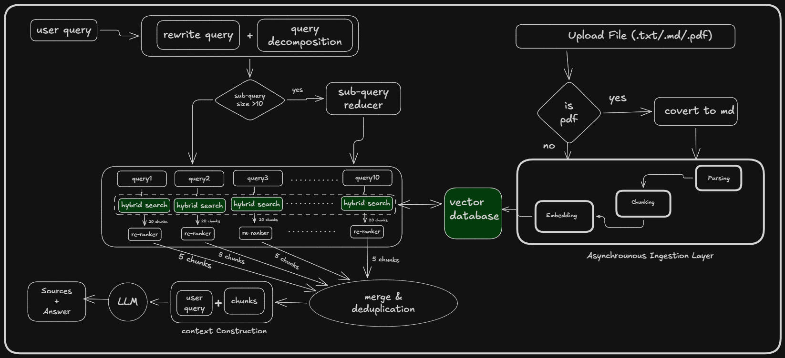
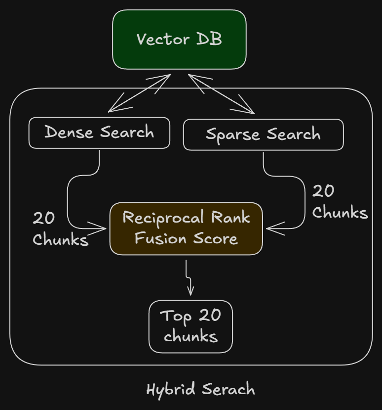

# DESIGN DOC


## 1. Architecture

The system follows a RAG architecture consisting of document ingestion, hybrid retrieval, reranking, and grounded answer generation.


### Hybrid Retrieval

The retrieval layer combines dense and sparse search. Each retrieval method
returns candidate chunks, which are combined using Reciprocal Rank Fusion
(RRF) before selecting the top-ranked chunks.


## 2. Chunking & Retrival

### Document Processing
The ingestion pipeline accepts PDF, Markdown, and TXT documents. PDF documents are first converted to Markdown so that the document structure can be processed consistently across supported formats.

During processing the file system identifies structual elements liek headings,paragraphs
and tables.This structure is preserved during chunking rather than treating the document as an unstructured block of text.

### Chunking Strategy

### Chunking Strategy


The system uses a combination of **structure-aware chunking** and **Recursive Text Splitting** based on the logical organization of the document.

Rather than splitting documents solely by a fixed character or token count, the initial chunking stage identifies meaningful structural boundaries such as:

* Headings and sections
* Paragraphs
* Tables

The relevant heading and section context is associated with each paragraph or table chunk. This preserves the semantic context required to correctly interpret the content during retrieval and generation.

To prevent structurally defined chunks from becoming excessively large, a **512-character threshold** with **10% overlap** is applied. If a structure exceeds this threshold, it is further divided using a Recursive Text Splitter. 

The recursive splitting process preserves the original **heading and section context** across the resulting sub-chunks. For example:

```text
Health Insurance
└── Standard Tier
    ├── Chunk 1
    │   └── [Heading + Section Context + Content]
    ├── Chunk 2
    │   └── [Heading + Section Context + Content]
    └── Chunk 3
        └── [Heading + Section Context + Content]
```

This hybrid approach addresses the main trade-off of structure-aware chunking: while structural boundaries preserve semantic meaning, some structures may be too large for effective retrieval. Recursive splitting limits chunk size while retaining the document's hierarchical context.

As a result, the system preserves both **manageable chunk sizes and meaningful semantic boundaries**, providing the embedding and generation stages with sufficient context without unnecessarily large chunks.

### Retrieval Pipeline

```text

The system uses hybrid retrieval, combining dense semantic search with sparse keyword-based search.

Dense retrieval is useful when the query and policy use different wording but express the same concept. Sparse retrieval is useful for exact policy terminology, benefit names, exclusions, employee tiers, and other terms where lexical matching is important.

Results from dense and sparse retrieval are combined using Reciprocal Rank Fusion (RRF). RRF combines the rankings from both retrieval methods without requiring their raw similarity scores to be directly comparable.

The resulting candidates are then passed through a reranking stage to evaluate their relevance to the specific query. The highest-ranked chunks are selected as the final retrieval context for answer generation.
```
### Query Decomposition

```text
Complex policy questions may contain multiple independent information requirements. The system uses a query-modification step to decompose such questions into concise, intent-specific sub-queries.

For example:

> What is my health insurance tier, annual coverage, optical allowance, and dental entitlement?

This is decomposed into separate intents, and each sub-query is retrieved independently. The results are then aggregated and deduplicated before being passed to the grounding and generation stages.

This increases retrieval cost and latency for complex queries, but improves answer quality by ensuring that chunks are retrieved for **each individual intent** rather than relying on a single retrieval operation for the entire question.
```
---

## 3. GROUNDING
### Context Construction
```text
The system uses the retrieved policy chunks as the primary source for answer generation. After hybrid search, RRF-based ranking, and re-ranking, the top-ranked chunks are selected for context construction and provided to the LLM.

For complex questions, the original question is decomposed into multiple intent-based sub-queries. Retrieval is then performed independently for each sub-query. The retrieved chunks from all sub-queries are aggregated, deduplicated where necessary, and constructed into a unified context.

This consolidated context is then passed to the LLM, which generates the final answer based on the retrieved policy information.

The generation prompt instructs the model to answer using the provided context and not introduce policy information that is not supported by the retrieved documents.
```
### Source Attribution
```text
Retrieved chunks are retained alongside the generated answer so that the response can be traced back to the source policy content.

The `/query` endpoint returns a sources field containing the sources associated with the retrieval results. These sources are used by the client to provide citations for claims in the generated response.

Source attribution is particularly important for HR policy questions because users need to be able to verify where a benefit, eligibility rule, coverage amount, or exclusion came from
```
### Weak Retrival
```text
The system treats weak retrieval as a failure condition rather than allowing the LLM to fill the missing information using its general knowledge.

If the retrieved chunks do not provide sufficient evidence for the user's question, the system should avoid generating a definitive policy answer. Instead, the response should indicate that the available policy context does not contain enough information to answer the question reliably.

This approach prioritizes grounding over answer completeness. A missing or uncertain policy answer is preferable to an incorrect answer that appears authoritative.
```
---

## 4. Schema & APIs

The system exposes three main endpoints covering document ingestion, query
creation, and streamed answer generation.

### 4.1 `/upload`

The `/upload` endpoint accepts policy documents in Markdown, TXT, or PDF
format. Uploaded files are processed and indexed so they can be used during
subsequent queries.

#### Request

```json
{
  "files": []
}
```
#### Response

```json
{
    "success":boolean,
    "pathIds":[]
}
```

### 4.2 `/query`
The `/query` endpoint accepts a user's question and the IDs of the documents
that should be searched.

#### Request
```json
{
  "body": {
    "question": "What is my annual health insurance coverage?",
    "filePathsIds": []
  }
}
```

#### Response
```json
{
  "queryId": "...",
  "sources": []
}
```


The `queryId` uniquely identifies the query and is used by the streaming
endpoint to retrieve the generated answer.

The `sources` contain the retrieved information required for citations. This
allows the client to associate the final answer with the policy evidence used
by the RAG pipeline.

### 4.3 `/query/stream?queryId=<queryId>`
The `/query/stream` endpoint generates and streams the answer for an existing
query.
The query ID is provided as a URL query parameter.

#### Request
```json
{
  "query": {
    "queryId": "..."
  }
}
```

#### Response
```json
{

    stream output
}
```

Streaming allows the frontend to display the generated response incrementally
instead of waiting for the complete LLM response.

---

## 5. Trade-offs

### Structure-Aware Chunking vs Fixed-Size Chunking
```text
A fixed-size chunking strategy is simpler and provides consistent chunk sizes, but it can split content across semantic boundaries. The system therefore uses structure-aware chunking and applies Recursive Text Splitting only when a structure exceeds 500 characters.

This preserves document structure while keeping chunks within a manageable size.
```
###  Dense Retrieval vs Hybrid Retrieval
```text
Dense retrieval provides strong semantic matching but can miss exact policy terminology. Since policy documents contain specific terms, benefit names, exclusions, and numerical values, the system combines dense and sparse retrieval.

RRF is then used to combine the results from both retrieval methods. This improves retrieval coverage at the cost of additional retrieval complexity.
```
### Single Query vs Query Decomposition
```text
Using the original query directly is simpler and has lower latency, but complex questions can contain multiple independent intents. The system therefore decomposes complex queries into intent-specific sub-queries and retrieves results independently.

This increases retrieval cost and latency, but improves coverage by allowing each intent to retrieve its own relevant chunks.
```
---
## 6. Future Improvements

If I had two additional weeks, I would prioritize the following improvements:

### 1. Retrieval Evaluation

Build an evaluation dataset containing representative policy questions and their expected source chunks. This would allow systematic measurement of retrieval quality and help tune chunking, hybrid retrieval, and reranking.

### 2. Chunking Improvements

Extend the structure-aware chunking logic to support additional document structures such as lists, nested lists, blockquotes, and other Markdown elements. Currently, chunking primarily handles headings, paragraphs, and tables, which can result in list-based policy information being poorly represented during retrieval.

### 3. Document Versioning

Implement document versioning so that policy changes can be tracked over time. This would allow queries to be associated with the specific policy version used to generate an answer, improving traceability and preventing outdated policy information from being used.